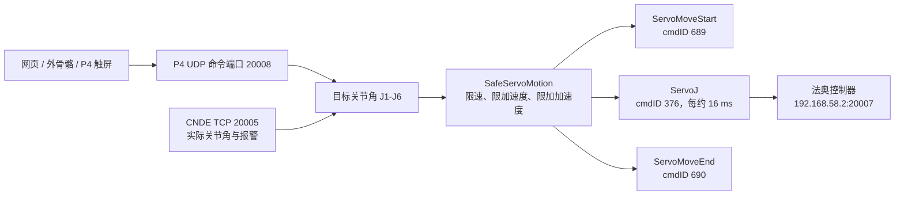

# P4 向法奥机械臂发送运动指令说明

本文说明 ESP32-P4 控制终端如何接收网页、外骨骼和自检目标，如何进行安全插补，以及如何使用法奥 UDP ServoJ 协议向机械臂发送运动指令。

## 1. 总体链路



主要网络参数：

| 设备或协议 | 地址与端口 | 用途 |
|---|---|---|
| P4 命令服务器 | `192.168.58.100:20008/UDP` | 接收网页和外骨骼命令 |
| 法奥运动接口 | `192.168.58.2:20007/UDP` | 发送 ServoJ 等运动指令 |
| 法奥 CNDE | `192.168.58.2:20005/TCP` | 回读实际关节角、状态和报警 |

## 2. P4 接收运动目标

### 2.1 网页手动控制

网页通过 Node.js 代理向 P4 发送文本命令：

```text
servo j1 10.0 -20.0 30.0 0.0 45.0 0.0
```

P4 将六个关节角解析为 `CMD_SERVO_MOVE`，然后放入普通命令队列。普通队列可保存 16 条命令，满时覆盖最旧命令。急停拥有单独的最高优先级队列。

相关代码：

- `firmware/p4-controller/p4-controller.ino`：`processCmd()`
- `firmware/p4-controller/cmd_queue.h`：`CmdQueue`、`RingBuffer`

### 2.2 外骨骼控制

S3 外骨骼发送：

```text
EXO:序号,H1,H2,H3,H4,H5,H6,mV1,mV2,mV3,mV4,mV5,mV6
```

P4 对每个传感器角度依次应用：

```text
相对角度 = 当前传感器角度 - 外骨骼零点
机器人目标 = 相对角度 × 方向参数
```

固定映射关系为：

| 外骨骼 | 人体动作 | 机械臂关节 |
|---|---|---|
| H1 | 肩部左右侧动 | J1 |
| H2 | 肩部前后摆动 | J2 |
| H3 | 小臂绕轴旋转 | J4 |
| H4 | 肘部屈伸 | J3 |
| H5 | 手腕旋转 | J6 |
| H6 | 手腕前后弯曲 | J5 |

每个 H 通道有独立的 `+1/-1` 方向参数，并由 P4 保存到 NVS。每收到一个新的外骨骼序号，P4 就更新一次 `robotTargets[6]`。

## 3. 从机械臂实际位置开始运动

P4 不直接从网页模型位置或上一条理论命令开始运动，而是通过 CNDE 读取机械臂当前实际关节角。

CNDE 配置的输出周期为 `5 ms`，订阅字段为：

```text
actual_joint_pos,robot_state,program_state,main_code,sub_code
```

当前机械臂返回的六个关节角按六个 `double` 解析，共 48 字节。开始新运动前，CNDE 数据必须有效，并且更新时间不能超过 `500 ms`。

随后 P4 调用：

```cpp
g_safeMotion.setTarget(target, robotState.jointPos, continuous);
```

因此安全插补的起点是机械臂当前真实姿态。

相关代码：

- `firmware/p4-controller/cnde_client.cpp`：`sendOutputConfig()`、`parseStateData()`
- `firmware/p4-controller/p4-controller.ino`：`robotFeedbackFresh()`

## 4. 进入 Servo 模式

首次设置运动目标时，`SafeServoMotion::setTarget()` 执行以下步骤：

1. 检查六个目标值是否为有效有限数值。
2. 保存目标关节角到 `_target[6]`。
3. 将 `_command[6]` 初始化为 CNDE 实际关节角。
4. 将速度 `_velocity[6]` 和加速度 `_acceleration[6]` 清零。
5. 发送 `ServoMoveStart()`，命令 ID 为 `689`。
6. 激活独立的 ServoJ 网络任务。

如果 ServoJ 已经处于运行状态，再收到目标时只更新 `_target[6]`，不会再次发送 `ServoMoveStart()`。因此网页连续点击不同目标或外骨骼不断更新姿态时，不需要先停止上一条命令。

## 5. FreeRTOS 运动网络任务

P4 创建了独立的运动任务：

```cpp
xTaskCreatePinnedToCore(
    safeMotionNetworkTask,
    "servo-net",
    6144,
    nullptr,
    4,
    &s_motionTaskHandle,
    0);
```

任务固定在 Core 0，优先级为 4。运动激活时调用 `g_safeMotion.tick(true)`，每次发送后等待约 `15 ms`。

ServoJ 的协议周期参数为：

```text
cmdT = 0.016 s
```

实际发送周期约等于 ServoJ 计算和 UDP 发送耗时再加上 15 ms 延时，因此它是接近 16 ms 的周期，而不是硬实时定时器产生的绝对 16 ms。

## 6. 安全插补算法

当前参数定义在 `firmware/p4-controller/safe_motion.h`：

| 参数 | 当前值 | 作用 |
|---|---:|---|
| `CMD_T_SEC` | `0.016 s` | ServoJ 指令周期 |
| `COMMAND_SPEED_DEG_S` | `20°/s` | J1-J6 最大指令速度 |
| `HARD_SPEED_LIMIT_DEG_S` | `20°/s` | 单周期硬速度上限 |
| `MAX_ACCEL_DEG_S2` | `10°/s²` | J1-J6 最大加速度 |
| `MAX_JERK_DEG_S3` | `80°/s³` | 最大加加速度 |
| `CONTROLLER_OMEGA` | `1.5` | 二阶控制器响应参数 |
| `POSITION_EPSILON_DEG` | `0.05°` | 到位误差 |

每个周期对每个关节执行：

```text
位置误差 = 目标角度 - 当前命令角度

期望加速度 = omega^2 × 位置误差 - 2 × omega × 当前速度

加速度变化限制：±80°/s³
加速度限制：    ±10°/s²
速度限制：      ±20°/s
单周期角度限制：±20 × 0.016 = ±0.32°
```

代码中的主要计算为：

```cpp
desiredAcceleration =
    omega * omega * delta - 2.0f * omega * velocity;

acceleration += constrainedAccelerationChange;
velocity += acceleration * dt;
command += velocity * dt;
```

即使网页一次发送从 `0°` 到 `90°` 的目标，P4 也不会在下一帧直接发送 `90°`，而是连续生成小角度 ServoJ 指令逐步靠近目标。

## 7. ServoJ 指令内容

每个插补周期调用：

```cpp
servoJ(
    j1, j2, j3, j4, j5, j6,
    0.0f, 0.0f, 0.016f, 0.0f, 0.0f);
```

转换成法奥命令字符串：

```text
ServoJ({J1,J2,J3,J4,J5,J6},
       {0.000,0.000,0.000,0.000},
       acc,vel,cmdT,filterT,gain,0)
```

示例：

```text
ServoJ({10.320,-20.160,30.080,0.000,45.000,0.000},
       {0.000,0.000,0.000,0.000},
       0.000000,0.000000,0.016000,0.000000,0.000000,0)
```

当前 `acc`、`vel`、`filterT` 和 `gain` 均传 `0`。这些协议参数目前没有开放给上层设置，速度、加速度和加加速度主要由 P4 的 `SafeServoMotion` 软件插补控制。

## 8. 法奥 UDP 帧封装

ServoJ 的命令 ID 为 `376`。法奥 UDP 文本帧格式为：

```text
/f/bIII{序号}III{命令ID}III{内容字节数}III{命令内容}III/b/f
```

ServoJ 帧示意：

```text
/f/bIII42III376III...IIIServoJ({...})III/b/f
```

P4 通过 `WiFiUDP` 将帧发送到 `192.168.58.2:20007`：

```cpp
_udp.beginPacket(_ip.c_str(), _port);
_udp.write((const uint8_t*)frame.c_str(), frame.length());
_udp.endPacket();
```

发送失败时最多重试三次。正常 ServoJ 流不会等待每一帧的机械臂响应；`FR_OK` 表示 UDP 数据已经成功交给 P4 网络栈，不表示机械臂已经运动到目标。实际运动状态通过 CNDE 独立确认。

相关代码：

- `firmware/p4-controller/fairino_udp.h`：命令 ID 和协议常量
- `firmware/p4-controller/fairino_udp.cpp`：`packFrame()`、`sendCommand()`、`servoJ()`

## 9. 单次运动与外骨骼连续跟随

### 9.1 网页和自检目标

网页目标与自检通常使用：

```cpp
continuous = false;
```

运动到达目标后，P4 发送：

```text
ServoMoveEnd()，cmdID 690
```

然后结束 ServoJ 流并将控制状态切回 `IDLE`。

### 9.2 外骨骼跟随

外骨骼使用：

```cpp
continuous = true;
```

到达当前目标后仍保持 ServoJ 模式。新的外骨骼数据到达时只更新目标，插补器从当前命令位置继续平滑追踪新目标。

```text
首次启用：ServoMoveStart
持续运行：ServoJ、ServoJ、ServoJ……
新姿态到达：更新目标，不重启 Servo 模式
关闭或异常：ServoMoveEnd
```

## 10. 停止、急停和错误处理

| 情况 | P4 行为 |
|---|---|
| 普通运动到位 | 发送 `ServoMoveEnd()`，ID `690` |
| 用户关闭外骨骼跟随 | 发送 `ServoMoveEnd()` |
| 外骨骼超过 `1500 ms` 无数据 | 暂停跟随并发送 `ServoMoveEnd()`，网页开关保持开启 |
| ServoJ UDP 发送失败 | 发送 `ServoMoveEnd()`，进入 `ERROR` |
| CNDE 返回非零报警码 | 停止运动、清空队列、关闭外骨骼并进入 `ERROR` |
| 网页心跳超过 `2000 ms` | `StopMotion()` 后发送 `ServoMoveEnd()`，进入 `E-STOP` |
| 用户急停 | 立即清队列并发送 `StopMotion()` 和 `ServoMoveEnd()` |

法奥立即停止命令使用命令 ID `102`，内容为：

```text
STOP
```

对应完整帧示意：

```text
/f/bIII...III102III4IIISTOPIII/b/f
```

急停不经过普通运动队列，避免等待前面的运动命令执行。

## 11. 当前安全边界

当前 P4 已实现：

- 所有关节统一限制为 `20°/s`。
- 所有关节统一限制为 `10°/s²`。
- 使用 `80°/s³` 加加速度限制平滑启停。
- 单周期指令变化不超过约 `0.32°`。
- 从 CNDE 实际关节角开始插补。
- 机械臂报警、外骨骼超时、心跳超时和 UDP 发送失败时停止运动。
- 外骨骼新目标只更新现有 ServoJ 流，不反复启停。

当前 P4 尚未实现完整的分关节机械角度限位表。`SafeServoMotion::validJoints()` 只检查数值是否为有限数，不检查每个关节是否超过机械范围。因此最终关节限位、碰撞检测和实际超速报警仍由法奥控制器负责。

另外，P4 的 `20°/s` 是连续 ServoJ 指令轨迹的速度限制，不等于对机械臂实际测量速度进行闭环限速。当前 CNDE 实际关节速度没有参与插补闭环；P4 主要使用 CNDE 实际位置作为运动起点，并使用 `mainCode/subCode` 处理控制器报警。

## 12. 关键源码索引

| 文件 | 作用 |
|---|---|
| `firmware/p4-controller/p4-controller.ino` | 命令接收、外骨骼处理、任务创建、状态机和停止逻辑 |
| `firmware/p4-controller/safe_motion.h` | ServoJ 周期、速度、加速度和加加速度参数 |
| `firmware/p4-controller/safe_motion.cpp` | 安全插补、Servo 模式启停和连续目标更新 |
| `firmware/p4-controller/fairino_udp.h` | 法奥命令 ID、UDP 协议常量和客户端接口 |
| `firmware/p4-controller/fairino_udp.cpp` | 法奥命令字符串、帧封装和 UDP 发送 |
| `firmware/p4-controller/cnde_client.h` | CNDE 状态结构和客户端接口 |
| `firmware/p4-controller/cnde_client.cpp` | CNDE 配置、状态接收、实际关节角和报警解析 |
| `firmware/p4-controller/cmd_queue.h` | 命令队列、心跳监控和机器人控制状态机 |

